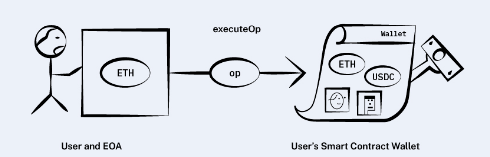
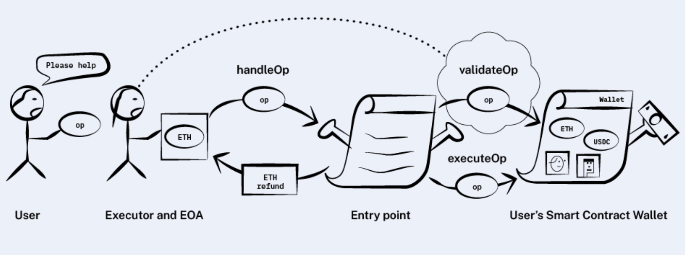
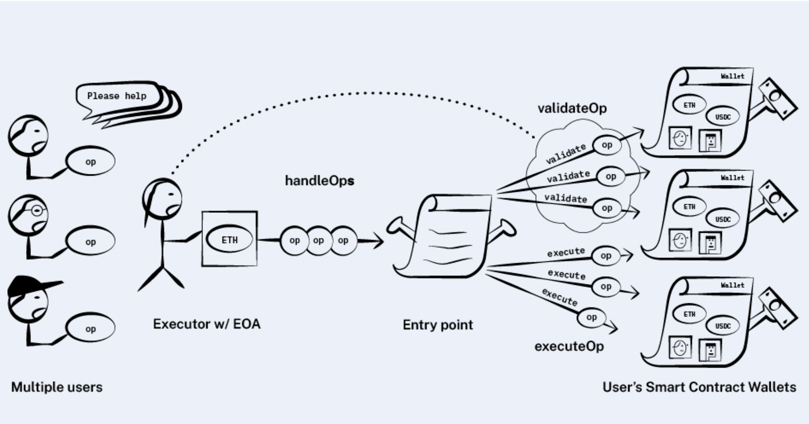

# [You Could Have Invented Account Abstraction](https://www.alchemy.com/blog/account-abstraction) - implementing AA following the article

I'm trying to implement all the steps of the article series of the famous article
[You Could Have Invented Account Abstraction](https://www.alchemy.com/blog/account-abstraction)

## Step 1 - User operations
### Create A wallet and call it from EOA

This implements from start of the article to "Goal: No separate EOA"

Contracts: contracts/step-1

test: test/step-1

## Step 2 - Goal: No separate EOA

This implements from "Goal: No separate EOA" to "No Separate EOA Recap" 

This does not implement the validation of opcodes and storage modification in validateOp

Contracts: contracts/step-2

test: test/step-2

## Step 3 - Interlude: Bundling

This implements from "Interlude: Bundling" to the end

Contracts: contracts/step-3

test: test/step-3

## Step 4 - [Paymaster](https://www.alchemy.com/blog/account-abstraction-paymasters)

This implements "Account Abstraction Part 2: Sponsoring Transactions Using Paymasters"

Contracts: contracts/step-4

test: test/step-4

## How to test it
`npx hardhat test`